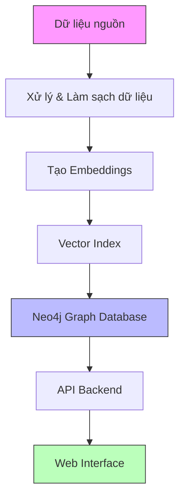
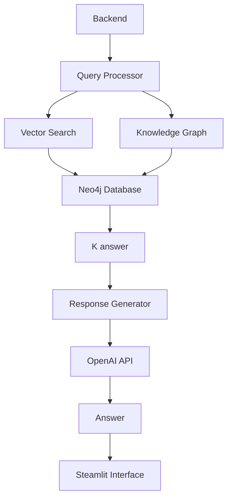

# Hệ thống Vector Search cho Đại học Sài Gòn

## Giới thiệu
Hệ thống tìm kiếm thông minh cho Trường Đại học Sài Gòn sử dụng Vector Search và OpenAI để tạo câu trả lời chính xác từ dữ liệu có cấu trúc.

## Kiến trúc tổng quan



## Quy trình xây dựng hệ thống

### 1. Chuẩn bị dữ liệu và Ontology

#### a. Xây dựng Competency Questions
```
- Đặt ra các câu hỏi (Q) từ dữ liệu nguồn, bước này có thể sử dụng Chat AI miễn phí để generate ra câu hỏi
- Đưa các câu hỏi đó vào folder QA
QA/
├── QA_SGU_v1.txt          # Các câu hỏi năng lực
└── QA_SGU_v2.txt          # Các câu hỏi năng lực
```

#### b. Tạo Ontology từ Competency Questions
```bash
# Tự động tạo ontology từ câu hỏi năng lực
python utils.py
```
- File ontology được tạo tại: `ontology/ontology_generated.ttl`
- Xác định các lớp (Classes) và mối quan hệ (Relationships)
- Định nghĩa cấu trúc dữ liệu chuẩn

#### c. Chuẩn bị dữ liệu nguồn
Cấu trúc thư mục dataset:
```
dataset/
├── PHẦN 1_section_I.txt
├── PHẦN 1_section_II.txt
├── PHẦN 1_section_III.txt
├── PHẦN 1_section_IV.txt
├── PHẦN 1_section_V.txt
├── PHẦN 1_section_VI.txt
└── ... các file khác
```

### 2. Xây dựng Knowledge Graph

#### a. Sinh Cypher Queries
```bash
python run.py
```
Quá trình này sẽ:
1. **Đọc dữ liệu PHẦN 1**:
   - Chỉ xử lý các file bắt đầu bằng "PHẦN 1" trong thư mục `dataset/`
   - Ví dụ: PHẦN 1_section_I.txt, PHẦN 1_section_II.txt, etc.
   - Bỏ qua các file PHẦN 2 và các file khác

2. **Đọc ontology**:
   - Đọc file `ontology/ontology_generated.ttl`
   - Sử dụng làm cơ sở cho việc sinh Cypher queries

3. **Xử lý dữ liệu**:
   - Chia nhỏ nội dung từng file thành các đoạn 3000 ký tự
   - Đảm bảo không cắt giữa câu hoặc đoạn văn
   - Giúp GPT xử lý hiệu quả hơn

4. **Sinh Cypher queries**:
   - Sử dụng OpenAI API để phân tích từng đoạn
   - Tạo các câu lệnh MERGE phù hợp với ontology
   - Đảm bảo tính nhất quán của dữ liệu

5. **Lưu trữ kết quả**:
   - Kiểm tra và làm sạch mã Cypher
   - Lưu tất cả queries vào `cypher/populate_ontology.cypher`
   - Sẵn sàng cho việc import vào Neo4j

### 3. Vector Index và Embeddings

#### a. Tạo Vector Embeddings


1. **Chunking và Preprocessing**:
   - Chia văn bản thành các đoạn có độ dài phù hợp (chunking)
   - Làm sạch dữ liệu: loại bỏ ký tự đặc biệt, định dạng văn bản
   - Lưu metadata cho mỗi chunk để truy xuất nguồn

2. **Tạo Embeddings**:
   ```python
   from openai import OpenAI
   
   # Tạo embedding vector cho mỗi chunk
   def create_embedding(text_chunk):
       client = OpenAI()
       response = client.embeddings.create(
           model="text-embedding-ada-002",
           input=text_chunk,
           encoding_format="float"
       )
       return response.data[0].embedding
   ```

3. **Xây dựng Vector Index**:
   ```cypher
   // Tạo vector index trong Neo4j
   for label in node_labels:
        try:
            index_name = f"{label.lower()}_embedding_index"
            neo4j.create_vector_index(
                index_name=index_name,
                node_label=label
            )
            print(f"Created index: {index_name}")
        except Exception as e:
            print(f"Error creating index for {label}: {str(e)}")

#### b. Lưu trữ và Truy vấn

1. **Lưu Embeddings**:
   ```cypher
   update_query = f"""
                MATCH (n:{labels_str}) WHERE ID(n) = $node_id
                SET n.embedding = $embedding
                """
                neo4j.run_cypher(update_query, {
                    "node_id": node['id'],
                    "embedding": embedding
                })
   ```

2. **Vector Search Query**:
   ```cypher
   // Tìm kiếm k chunks gần nhất
    results = neo4j.similarity_search(
                query_text=query,
                node_label=node_type,
                limit=limit,
                min_similarity=min_similarity
            )
   ```

### 4. Giao diện và Xử lý

#### a. Kiến trúc Backend



